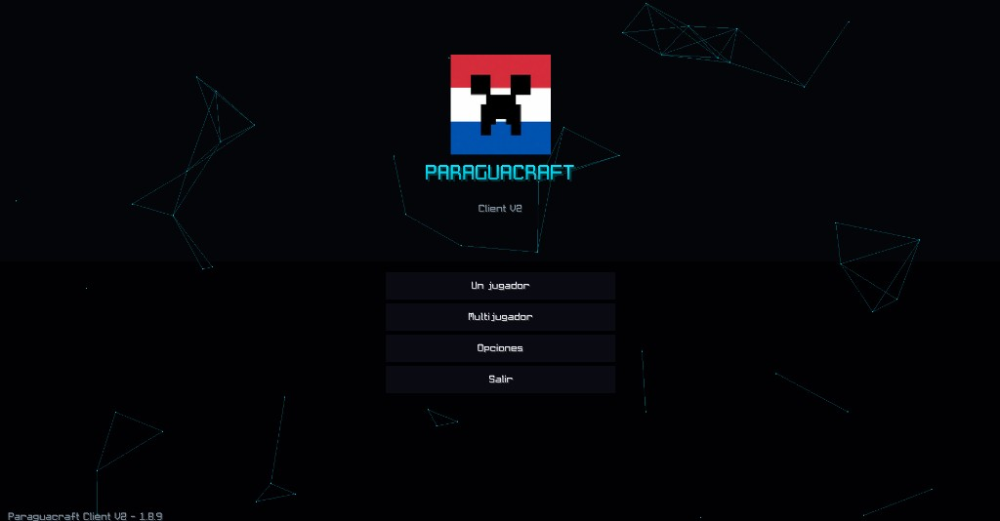
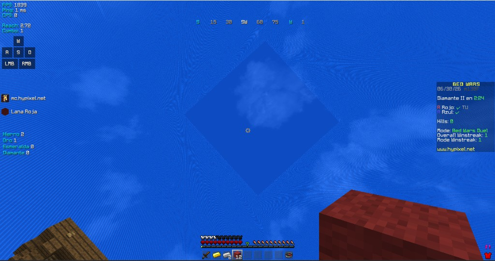

# Paraguacraft

**Launcher de Minecraft de alto rendimiento** — Tauri v2 + Rust + Vue 3

[**Descargar**](https://github.com/SantiJ10/Paraguacraft/releases/latest) · [**Web**](https://paraguacraft.pages.dev) · [**Issues**](https://github.com/SantiJ10/Paraguacraft/issues)

---

## ¿Qué es Paraguacraft?

Paraguacraft es un launcher de **Minecraft Java Edition** pensado para jugadores que quieren **más FPS y menos lag del propio launcher**. No compite con tu PC mientras jugás: cuando abrís Minecraft, el runtime del launcher se apaga y queda en **0 % CPU** en segundo plano.

Incluye el **cliente oficial Paraguacraft PvP** (Forge 1.8.9 + OptiFine + mod propio con HUD estilo Lunar), tienda **Modrinth + CurseForge**, modpacks, servidores locales con **Playit.gg**, skins offline y diagnóstico de crashes.

## ⭐ Cliente destacado: Paraguacraft PvP

Cliente competitivo de **Minecraft 1.8.9** listo para Hypixel: **Forge + OptiFine** y un mod propio con HUD estilo Lunar y optimizaciones integradas. **Más FPS, cero configuración, sin login ni mods extra** y se actualiza solo desde el launcher.

| Menú principal | BedWars en Hypixel |
|:---:|:---:|
|  |  |

**Qué trae:**

- 🚀 **Boost FPS integrado** — OptiFine Fast Render + culling propio + limpieza de memoria. Hasta **3–4× más FPS** que vanilla.
- 🎯 **HUD competitivo** — reach, combo, keystrokes, CPS, FPS/ping y % de armadura, todo arrastrable.
- 🟢 **100% legal en Hypixel** — solo visual y de rendimiento (sin reach hack, autoclicker ni macros).
- 🎵 **Overlay de música** — Spotify y YouTube/YT Music con carátula y nombre dentro del juego.
- 🧊 **Freelook + QoL** — cámara libre, toggle sprint/sneak, fullbright, camas de color, ping en nametag.
- ⚙️ **Se actualiza solo** — Forge 1.8.9 + OptiFine sincronizados desde el launcher con SHA-1.

### FPS promedio (BedWars, render 4–6 chunks)

| Hardware | Vanilla 1.8.9 | Paraguacraft PvP | Ganancia |
|----------|---------------|------------------|----------|
| Gama baja (Intel UHD / Ryzen 3 · 4 GB) | 60 – 110 | **230 – 380** | ≈ 3.5× |
| Gama media (GTX 1050/1650 · 8 GB) | 180 – 350 | **700 – 1100** | ≈ 3× |
| Gama alta (RTX 3060+ · 16 GB) | 450 – 800 | **1500 – 2200** | ≈ 3× |

> Valores aproximados; varían según GPU, drivers y resolución.

### Paraguacraft PvP vs otros clientes

| Aspecto | Paraguacraft PvP | Lunar | Badlion | Vanilla + OptiFine |
|---------|------------------|-------|---------|--------------------|
| Precio | Gratis | Gratis | Gratis / Plus pago | Gratis |
| Boost de FPS | Fast Render + culling + anti-leak | Alto | Alto | Solo OptiFine |
| Overlay de música | Spotify + YouTube con carátula | Solo Spotify | Solo Spotify | No |
| Quick Play Hypixel | Sí (menú integrado) | Sí | Sí | No |
| Cuenta / login extra | No requiere | Cuenta Lunar | Cuenta Badlion | No |

## Para qué sirve

- Jugar **vanilla o con mods** (Fabric, Forge, NeoForge, Quilt, Iris…) en instancias separadas.
- Competir en **1.8.9 PvP** con el cliente optimizado del servidor Paraguacraft.
- Instalar mods, shaders y resource packs desde la **tienda integrada**.
- Crear **servidores Paper/Fabric/Forge** para amigos sin abrir puertos.
- **Reparar instancias** corruptas y ver logs sin salir del launcher.

## Qué incluye

| Área | Detalle |
|------|---------|
| **Rendimiento** | Motor de descargas en Rust, SHA-1, 0 % CPU al jugar, JVM/RAM automática por hardware |
| **Paraguacraft PvP 2.1.14** | Forge 1.8.9, OptiFine, mod HUD/GUI con optimizaciones, Quick Play Hypixel, overlay de música, alertas chat — **se actualiza solo** desde GitHub |
| **Tienda** | Modrinth + CurseForge, modpacks `.mrpack` y `.zip` |
| **Instancias** | Mods por carpeta, exportar/importar, reparar, favoritos con join directo |
| **Servidores** | Paper, Fabric, Forge + túnel Playit.gg |
| **Cuentas** | Microsoft (premium) y modo offline |
| **Extras** | Skins offline, Discord RPC, diagnóstico con IA, auto-update |

## Instalación

### 1. Descargá

Obtené el instalador Windows desde **[Releases](https://github.com/SantiJ10/Paraguacraft/releases/latest)** (`Instalar_Paraguacraft_vX.exe`).

### 2. Instalá

Ejecutá el `.exe`. Si falta **WebView2** o **Java**, el launcher los descarga e instala.

### 3. Jugá

- Iniciá sesión con **Microsoft** o modo **offline**.
- En **Versiones**, elegí **Paraguacraft PvP** (1.8.9) o cualquier otra versión/loader.
- Pulsá **Iniciar el juego**.

El cliente PvP se sincroniza automáticamente al instalar o lanzar (manifest + SHA-1 en GitHub). Si algo falla, usá **Reparar instancia** en el detalle de la instancia.

## Compatibilidad Hypixel

Los mods del cliente Paraguacraft PvP son **solo visuales y de HUD** (estilo Lunar/Badlion/OptiFine). No modifican alcance de golpe, movimiento, paquetes de red ni dan ventaja competitiva:

- **Permitidos**: fuego bajo, camas coloridas, ping en nametag, freelook, HUD reach/combo (solo lectura), keystrokes, overlay de música, títulos al chat, física de ítems, alertas de chat, juego rápido (`/play` manual).
- **No incluidos**: reach hack, autoclicker, xray, macros de combate, auto-play.

Reach Display y Combo Counter miden **tus** acciones locales para entrenar W-tapping; no extienden el hitbox del juego.

## Requisitos

| | |
|---|---|
| **SO** | Windows 10 / 11 (64-bit) |
| **RAM** | 4 GB mínimo · 8 GB recomendado |
| **Disco** | ~500 MB launcher + espacio para Minecraft y mods |
| **Internet** | Para descargar versiones y mods |

Mac y Linux están en el roadmap (el código es multiplataforma).

## Actualizaciones

El launcher avisa cuando hay una versión nueva y descarga desde **GitHub Releases** con verificación **SHA-256** (`latest.json`).

## Enlaces

- **Sitio web:** [paraguacraft.pages.dev](https://paraguacraft.pages.dev)
- **Código:** [github.com/SantiJ10/Paraguacraft](https://github.com/SantiJ10/Paraguacraft)
- **Changelog:** [CHANGELOG.md](CHANGELOG.md)
- **Desarrollo del launcher:** [launcher/README.md](launcher/README.md)

## Licencia

Ver [LICENSE](LICENSE).
